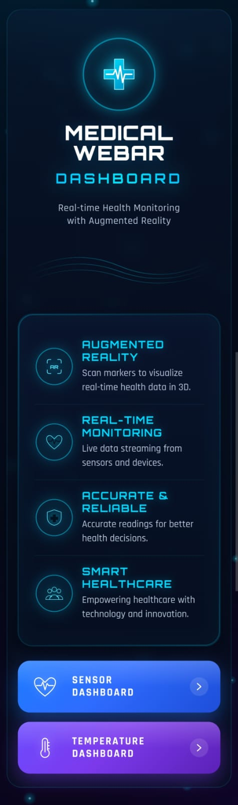
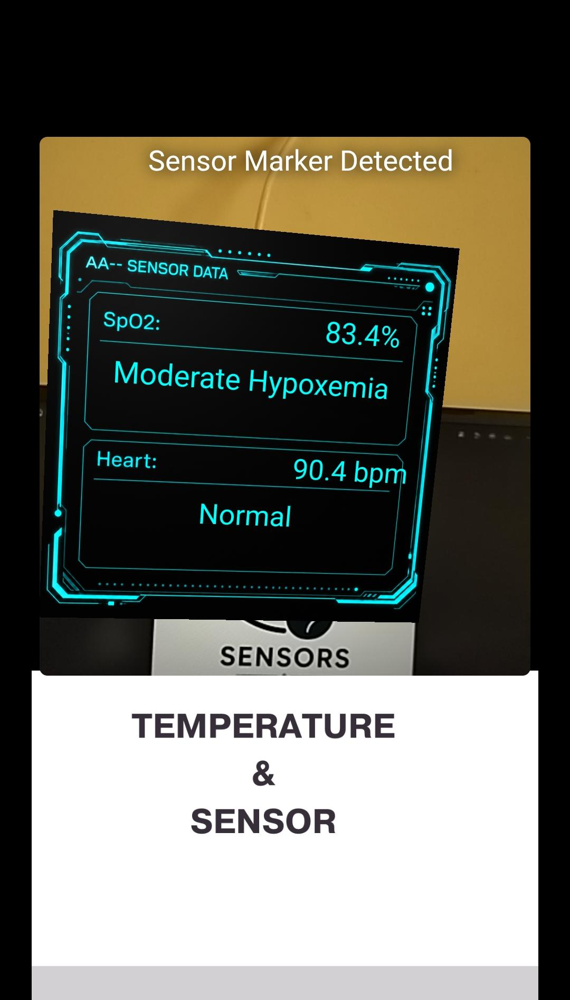
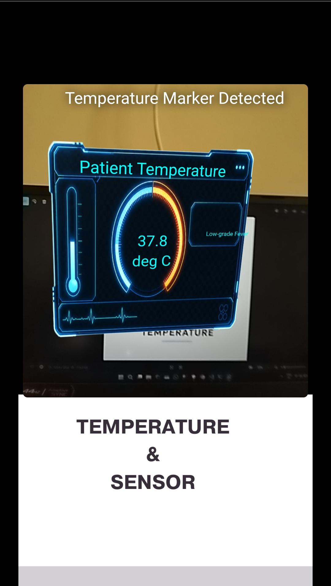

# AR/VR Smart Healthcare Monitoring and Emergency Response System

## Recommended Python Version

Python 3.10 or above recommended.

---

# Project Architecture

```txt
api project  → Backend APIs
simulator    → Sensor Simulator Frontend
WebAR        → Augmented Reality Frontend
```

---

# Step 1 — Create Virtual Environment

Open terminal inside the project root folder.

```bash
python -m venv venv
```

---

# Step 2 — Activate Virtual Environment

## Windows

```bash
venv\Scripts\activate
```

---

# Step 3 — Install Dependencies

```bash
pip install -r requirements.txt
```

---

# Step 4 — Change IP Address

Change the IP address with your computer's IP address.

To find your IP address:

Open terminal and type:

```bash
ipconfig
```

Your IPv4 address will be shown.

Search this line in the project files:

```txt
# Change this to your actual API URL
```

Changes must be made in:

```txt
api project folder /simulator_api_bridge.py
simulator folder /app.py

webAR folder /Temp.html and Sensor.html 
```

Replace the old IP address with your current IPv4 address.

---

# Step 5 — Start Backend API

Open terminal.

Go to:

```bash
cd api project
```

Run:

```bash
python app.py
```

Backend runs on:

```txt
Port 5000
```

---

# Step 6 — Start Simulator Frontend

Open another terminal.

Go to:

```bash
cd simulator
```

Run:

```bash
python app.py
```

Frontend runs on:

```txt
Port 5050
```

---

# Important

Inside:

```txt
simulator/
```

the `app.py` file is the frontend.

Inside:

```txt
api project/
```

the `app.py` file is the backend.

The data flow will work only when the backend is running.

---

# Step 7 — Open Simulator Frontend

Open the link shown in terminal.

Select the required option and click:

```txt
Start Simulator
```

The simulator will start generating sensor data.

---

# Step 8 — Start WebAR

Open another terminal.

Go to:

```bash
cd WebAR
```

Run:

```bash
python -m http.server 8080
```

---

# Step 9 — Open WebAR On Mobile

Open mobile browser and type:

```txt
http://YOUR-IP-ADDRESS:8080
```

Example:

```txt
http://192.168.1.5:8080
```

---

# Browser Permission Fix

If WebAR is not working due to browser security restrictions:

Open:

```txt
chrome://flags/
```

Search:

```txt
Insecure origins treated as secure
```

Add:

```txt
http://YOUR-IP-ADDRESS:8080
```

Set it to:

```txt
Enabled
```

Click:

```txt
Relaunch
```

Then reopen the WebAR URL.

---

# Camera Permission

Allow camera permission when browser asks.

---

# Medical WebAR Dashboard

After opening WebAR you will see:

```txt
Medical WebAR Dashboard
```

Select:

* Sensor Dashboard
* Temperature Dashboard

---

# Marker Tracking

## Sensor Dashboard

Show:

```txt
sensor_tracker.png
```

marker from:

```txt
WebAR/Images
```

folder.

---

## Temperature Dashboard

Show:

```txt
temp_tracker.png
```

marker from:

```txt
WebAR/Images
```

folder.

---

# Important

If:

* Temperature dashboard is selected
* Sensor marker is shown

augmentation will NOT appear.

Similarly:

* Sensor dashboard works only with sensor marker
* Temperature dashboard works only with temperature marker

---

# API Requirement

The augmentation and real-time sensor data will work only when BOTH:

```txt
api project/app.py
simulator/app.py
```

are running.

---

# Augmentation Controls

The augmentation displayed in AR can be:

* moved
* dragged
* zoomed

using touch gestures.

---

# Device Requirement

WebAR works best on Android mobile devices with camera support.

---

# Network Requirement

Phone and laptop must be connected to the same WiFi network.

Otherwise:

* phone cannot access the APIs
* augmentation data will not load

---

# Stopping Servers

```txt
Press CTRL + C in terminal to stop the servers.
```

```md
# Simulator Frontend

<p align="center">
  
</p>

<p align="center">
  Simulator Frontend Interface
</p>

---

# Medical WebAR Dashboard

<p align="center">
  
</p>

<p align="center">
  Medical WebAR Dashboard Home Screen
</p>

---

# Sensor Marker

<p align="center">
  
</p>

<p align="center">
  Sensor Dashboard Marker
</p>

---

# Temperature Marker

<p align="center">
  
</p>

<p align="center">
  Temperature Dashboard Marker
</p>

---

# Sensor Dashboard Augmentation

<p align="center">
  
</p>

<p align="center">
  Sensor Dashboard AR Overlay
</p>

---

# Temperature Dashboard Augmentation

<p align="center">
  
</p>

<p align="center">
  Temperature Dashboard AR Overlay
</p>
```
